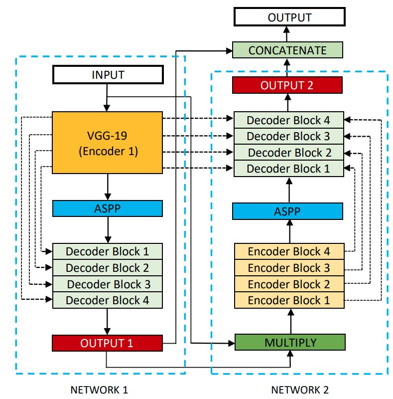
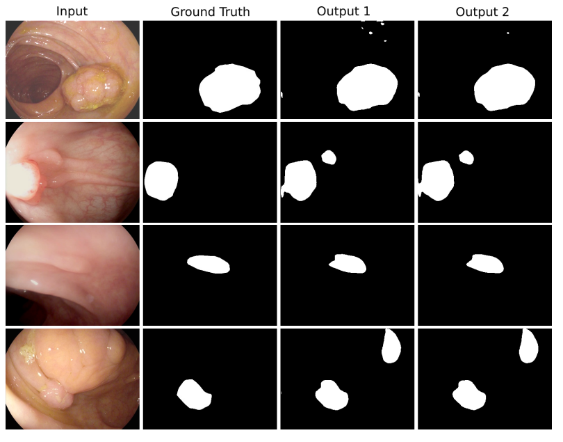
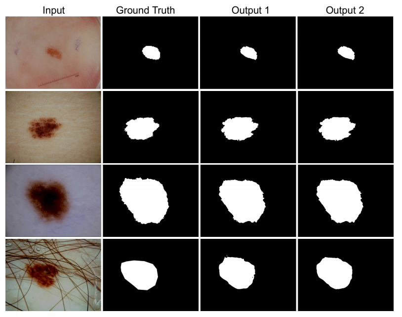
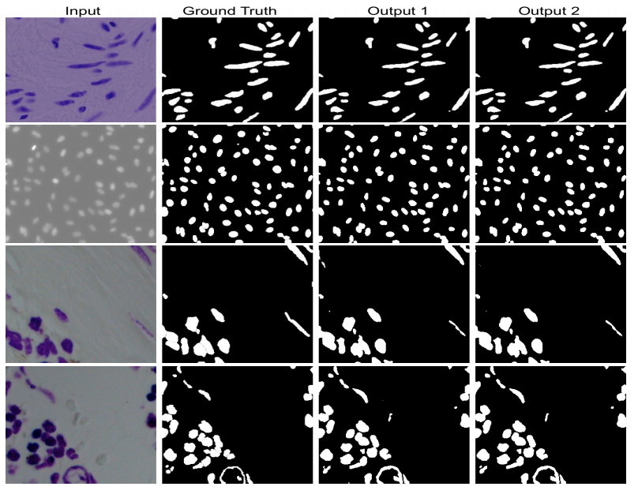

# DoubleU-Net: A Deep Convolutional Neural Network for Medical Image Segmentation
DoubleU-Net starts with a VGG19 as encoder sub-network, which is followed by decoder sub-network. In the network, the input image is fed to the modified UNet(UNet1), which generates predicted masks (i.e., output1). We then multiply the input image and the produced masks (i.e., output1), which acts as an input for the second modified U-Net(UNet2) that produces another the generated mask (output2). Finally, we concatenate both the masks (output1 and output2) to get the final predicted mask (output).  

Please find the paper here: [DoubleU-Net: A Deep Convolutional Neural
Network for Medical Image Segmentation](https://ieeexplore.ieee.org/stamp/stamp.jsp?tp=&arnumber=9183321), Arxiv: [DoubleU-Net: A Deep Convolutional Neural
Network for Medical Image Segmentation](https://arxiv.org/pdf/2006.04868.pdf)

## Architecture

## Datasets:
The following datasets are used in this experiment:
<ol>
  <li>MICCAI 2015 Segmentation challenge(CVC-ClinicDB for training and ETIS-Larib for Testing)</li>
  <li>[CVC-ClinicDB] (https://www.kaggle.com/datasets/balraj98/cvcclinicdb)</li>
  <li>[Lesion Boundary segmentation challenge] (https://challenge.isic-archive.com/data/)/li>
  <li> [2018 Data Science Bowl challenge] (https://bbbc.broadinstitute.org/BBBC038/)</li>
 </ol>

## Hyperparameters:
 
 <ol>
  <li>Batch size = 16</li> 
  <li>Number of epoch = 300</li>
</ol>
<table>
  <tr> <td> Dataset Name</td> <td>Loss</td> <td>Optimizer</td> <td>Learning Rate</td>  </tr>
  <tr> <td>MICCAI 2015 Challenge Dataset</td> <td>Binary crossentropy</td> <td>Nadam</td> <td>1e-5</td> </tr>
  <tr> <td>CVC-ClinicDB</td> <td>Binary crossentropy</td> <td>Nadam</td> <td>1e-5</td> </tr>
  <tr> <td>Lesion Boundary segmentation challenge</td> <td>Dice loss</td> <td>Adam</td> <td>1e-4</td> </tr>
  <tr> <td>2018 Data Science Bowl challenge</td><td>Dice loss</td> <td>Nadam</td> <td>1e-4</td> </tr>
 </table>
 
## Weight file:
The weight file for the lesion boundary segmentation dataset can be found here:
[https://drive.google.com/file/d/1jjMYoMkbb866-1qh3bD546TVp-ZjKs9w/view?usp=sharing](https://drive.google.com/file/d/1jjMYoMkbb866-1qh3bD546TVp-ZjKs9w/view?usp=sharing)

The weight file for the CVC-612 and "2015 MICCAI sub-challenge on automatic polyp detection dataset"  can be found here:
[https://drive.google.com/file/d/14ahqFsLu-XlW8IRYmYptVocRGwsGm6Ea/view?usp=sharing](https://drive.google.com/file/d/14ahqFsLu-XlW8IRYmYptVocRGwsGm6Ea/view?usp=sharing)

The weight file for "the 2018 Data Science Bowl Challenge" and can be found here:
[https://drive.google.com/file/d/1J8yjNa_Oeuf26s2qRq6H0GEtp272oXY5/view?usp=sharing](https://drive.google.com/file/d/1J8yjNa_Oeuf26s2qRq6H0GEtp272oXY5/view?usp=sharing)

## Results
The model is trained on CVC-ClinicDB and tested on the ETIS-Larib polyp dataset.  

The model is trained and tested on CVC-ClinicDB.  

The model is trained and tested on Lesion Boundary segmentation challenge.  

The model is trained and tested 2018 Data Science Bowl Challenge.  

## Citation
Please cite our paper if you find the work useful: 
<pre>
  @INPROCEEDINGS{9183321,
  author={D. {Jha} and M. A. {Riegler} and D. {Johansen} and P. {Halvorsen} and H. D. {Johansen}},
  booktitle={2020 IEEE 33rd International Symposium on Computer-Based Medical Systems (CBMS)}, 
  title={DoubleU-Net: A Deep Convolutional Neural Network for Medical Image Segmentation}, 
  year={2020},
  pages={558-564}}
</pre>

## Contact
please contact debesh@simula.no for any further questions. 

