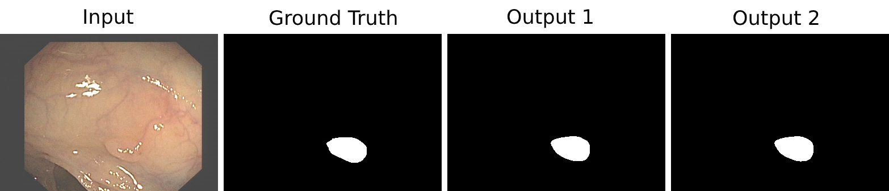
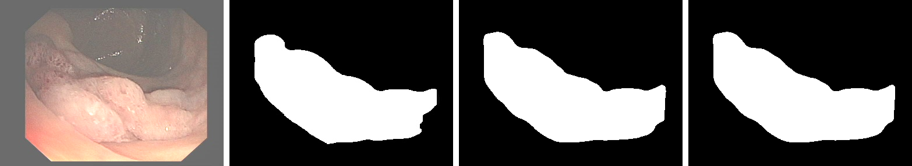
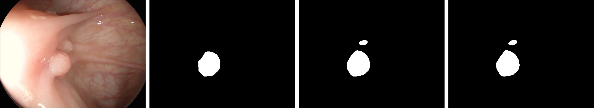

# DoubleU-Net
DoubleU-Net starts with a VGG19 as encoder sub-network, which is followed by decoder sub-network. In the network, the input image is fed to the modified UNet(UNet1), which generates predicted masks (i.e., output1). We then multiply the input image and the produced masks (i.e., output1), which acts as an input for the second modified U-Net(UNet2) that produces another the generated mask (output2). Finally, we concatenate both the masks (output1 and output2) to get the final predicted mask (output).  

## Architecture

## Datasets:
The following datasets are used in this experiment:
<ol>
  <li>MICCAI 2015 Segmentation challenge(CVC-ClinicDB for training and ETIS-Larib for Testing)</li>
  <li>CVC-ClinicDB</li>
  <li>Lesion Boundary segmentation challenge/li>
  <li> 2018 Data Science Bowl challenge</li>
 </ol>

## Hyperparameters:
 
 <ol>
  <li>Batch size = 16</li> 
  <li>Number of epoch = 300</li>
</ol>
<table>
  <tr> <td> Dataset Name</td> <td>Loss</td> <td>Optimizer</td> <td>Learning Rate</td>  </tr>
  <tr> <td>MICCAI 2015 Challenge Dataset</td> <td>Binary crossentropy</td> <td>Nadam</td> <td>1e-5</td> </tr>
  <tr> <td>CVC-ClinicDB</td> <td>Binary crossentropy</td> <td>Nadam</td> <td>1e-5</td> </tr>
  <tr> <td>Lesion Boundary segmentation challenge</td> <td>Dice loss</td> <td>Adam</td> <td>1e-4</td> </tr>
  <tr> <td>2018 Data Science Bowl challenge</td><td>Dice loss</td> <td>Nadam</td> <td>1e-4</td> </tr>
 </table>
 

## Results
The model is trained on CVC-ClinicDB and tested on the ETIS-Larib polyps dataset.  

